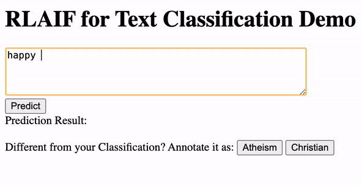

## RLAIF - Text Classification with Flask

### Task

To build a flask API endpoint for Reinforcement Learning with AI Feedback (RLAIF). With the API endpoint, you should be able to do the task here, but without a human needing to annotate data:
https://docs.anote.ai/active/classification.html

### Demo

### How it works

- This demo serves as a binary classifier for class "Atheism" and "Christian" from Scikit-Learn's $20newsgroups$ dataset, where users could type in a piece of text and get prediction results (containing label, confidence level and entropy score) by clicking the "Predict" button.
- If users find the classification result predicted by model not aligned with their own annotation, they could correct the model prediction by clicking the corresponding button following the text "Annotate it as: ". By doing so, the corrected label together with the text itself would be incorporated into the model and thus update the model prediction for future inputs. If, however, the result is aligned with human annotation, users could just leave it without clicking any button, or clicking the button for the corresponding class to emphasize the importance of correctly classifiying this specific text. This, by intuition, indicates certain keywords for classification to the model.
- From the demo above, we can observe that every time when the prediction result is corrected, future predictions on the same input text would be updated. Intuitively, as the model learns from previous predictions and corrected annotations, a correction of the prediction on certain text would directly change model's prediction result if asking it to classifiy the exact same text again. An increase in confidence level suggests that the model is becoming more confident for its prediction after users indicate a same classification result, vice versa. From this, we can verify that by incorporating human feedback, the model can adapt and improve its predictions over time.

### Uncertainties / Issues

- **Entropy**
    - **Issue**: Not sure how the entropy value is obtained for each prediction.
    - **Current solution**: It is now defined in $compute\_entropy$ as: $$-p*log_2(p) - (1-p)*log_2(1-p)$$, where $p$ refers to the confidence level for each prediction.
    - **Note**: Since it serves as the reference for sorting texts, which is not yet implemented in this demo, the entropy score is not printed out.

- **Model**
    - **Issue**: From my understanding, the endpoint should be built based on pre-trained LLMs (like GPT API from OpenAI), and then incorporate human corrections on model classification results to achieve a better classification performance. Yet I failed to access those models, potentially because of the regional limitation (as I'm currently outside of U.S.).
    - **Current solution**: As an alternative, I manually trained a SGDClassifier model on the $20newsgroups$ dataset from Scikit-Learn to realize a simple demo of binary classification ($'alt.atheism'$, $'soc.religion.christian'$), mimicking the spam classification given on the website.
    - **Note**: The documentation from Anote introduces the application of ensembling, yet so far I don't have a clear view on how to realize such integration and parallelization.

- **Not yet implemented due to time limit:**
    - **Support file input**: Based on my preliminary learning with Flask, the demo now only supports text input as pieces from textbox. My next step, if time allows, should enable the demo to deal with different file inputs (csv/txt/etc.). In this case, a batch of n pieces of texts could be read at one time, therefore realizing the iterative process of sorting by entropy scores.
    - **Generalize classification functionality**: Rather than binary classifications, the demo should first enable users to define classes, and then display texts and prediction results (based on user-defined classes) for them to further evaluate and/or correct.

### Learning Process

1. Learning Flask basics
2. Understanding RLAIF concepts
3. Understanding Anote's Text Classification with Active Learning
4. Try to code simple Flask demos
5. Deconstruct Anote's task into multiple aspects
6. Try to integrate each part into Flask
7. ...

### Important Reference

- Arxiv paper: [RLAIF: Scaling Reinforcement Learning from Human Feedback with AI Feedback](https://arxiv.org/abs/2309.00267)
- Flask documentation: [User Guide](https://flask.palletsprojects.com/en/latest/)
- Youtube video about Flask: [Create API endpoints with Flask](https://www.youtube.com/watch?v=duE5P1hG6sg)
- Anote documentation: [Text Classification with Active Learning](https://docs.anote.ai/active/classification.html?h=entropy#sorting-and-annotating-edge-cases)
- Medium article: [Reinforcement Learning from AI Feedback](https://anote-ai.medium.com/reinforcement-learning-from-ai-feedback-5d5dd53cd26e)
